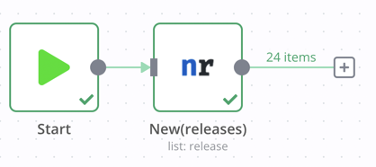
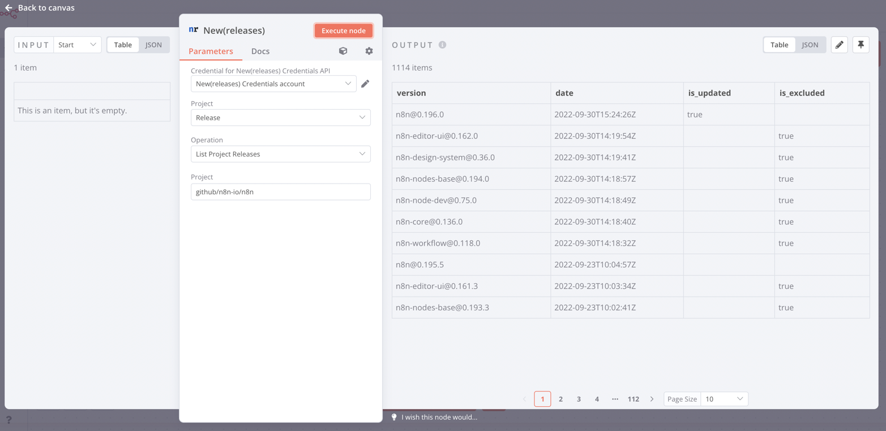

# n8n-nodes-newreleases

This is an n8n community node to interact with the [New(releases)](https://newreleases.io/) service, which scans rpositories from various providers (Github, Docker hub, npm...) to detect newly released versions and send notifications.

[n8n](https://n8n.io/) is a [fair-code licensed](https://docs.n8n.io/reference/license/) workflow automation platform.

[Installation](#installation)  
[Operations](#operations)  
[Credentials](#credentials)
[Compatibility](#compatibility)  
[Resources](#resources)  
[Version history](#version-history)

## Installation

Follow the [installation guide](https://docs.n8n.io/integrations/community-nodes/installation/) in the n8n community nodes documentation.

## Operations

* Projects:
  * List Projects
	* Search Projects
	* Get Single Project
	* Delete Project
* Releases:
	* List Project Releases
	* Get Single Project Release
	* Get Project Release Notes

## Credentials

API Key generated at <https://newreleases.io/settings/api-keys>

## Compatibility

Tested against n8n v0.196.0

## Resources

* [n8n community nodes documentation](https://docs.n8n.io/integrations/community-nodes/)
- [New(releases) website](https://newreleases.io/)
- [New(releases) API docs](https://newreleases.io/api/v1)

## Version history

### 0.1.0

First Release!
